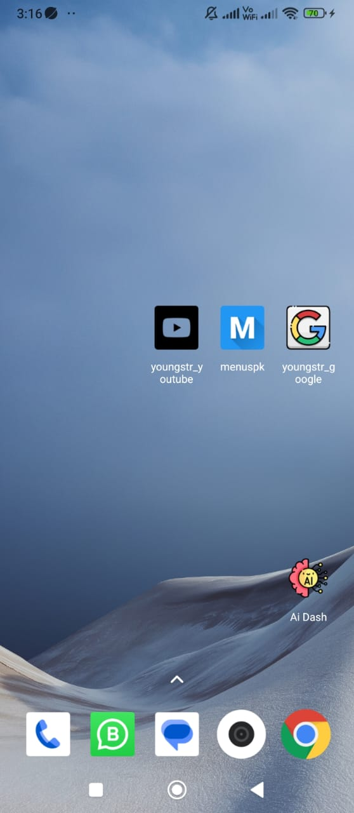

# Flutter Web App to Mobile App Generator

This Python script automates the process of creating mobile applications for existing websites using Flutter. It takes six parameters and generates the necessary Flutter project for the specified website.

## Screenshots


_Genrated Mobile apps_


_Menuspk_


_Youngstr Youtube_


_Youngstr Google_

## Prerequisites

Before running the script, ensure that you have the following installed:

- [Flutter](https://flutter.dev/docs/get-started/install)
- [Dart](https://dart.dev/get-dart)

## Usage

### Single App Generation (creater.py)

To create a mobile application for a single website, use the `creater.py` script. Provide the required parameters as follows:

```json
{
  "path": "C:/SALMAN/gits/web_app_cerater/apps",
  "name": "youngstr_youtube",
  "domain": "com.youtube",
  "description": "YOUNGSTR YOUTUBE MOBILE APP",
  "imgPath": "C:/SALMAN/gits/web_app_cerater/app_icons/youtube.png",
  "url": "https://youtube.com"
}
```

## Running the Scripts

### Single App Generation (creater.py)

To create a mobile application for a single website, use the `creater.py` script. Run the following command in your terminal:

```bash
create_menuspk.bat
```

## Multiple App Generation (multi_creater.py)

To generate mobile applications for multiple websites in parallel, use the `multi_creater.py` script. Add entries for each website in the input JSON file, like this:

```json
[
  {
    "path": "C:/SALMAN/gits/web_app_cerater/apps",
    "name": "youngstr_youtube",
    "domain": "com.youtube",
    "description": "YOUNGSTR YOUTUBE MOBILE APP",
    "imgPath": "C:/SALMAN/gits/web_app_cerater/app_icons/youtube.png",
    "url": "https://youtube.com"
  }
  // Add more entries as needed
]
```

```bat
create_all_apps.bat
```

## Notes

- The script assumes Flutter and Dart are properly installed on your machine.
- Ensure the provided website URLs are accessible and responsive.
- Be patient, as the process might take some time, especially for multiple applications.
- Feel free to customize the scripts and batch files according to your needs.
